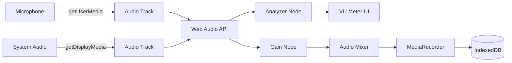
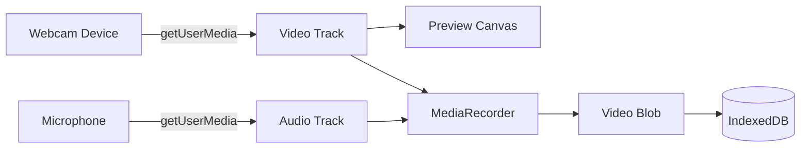

# ClipForge - Recording Features: Phase 2 PRD

## Audio & Webcam Recording

**Document Version**: 1.0  
**Phase**: 2 of 4  
**Duration**: Week 2 (5-7 days)  
**Last Updated**: 2025-10-29  
**Status**: Planning  
**Dependencies**: Phase 1 (Screen Recording) must be complete

---

## Table of Contents

1. [Executive Summary](#executive-summary)
2. [Phase Goals](#phase-goals)
3. [Scope & Deliverables](#scope--deliverables)
4. [Technical Architecture](#technical-architecture)
5. [Implementation Tasks](#implementation-tasks)
6. [Audio System Design](#audio-system-design)
7. [Webcam Integration](#webcam-integration)
8. [Multi-Stream Management](#multi-stream-management)
9. [Testing Requirements](#testing-requirements)
10. [Success Criteria](#success-criteria)

---

## Executive Summary

### Phase Overview

Phase 2 extends the recording infrastructure built in Phase 1 by adding audio capture (system audio + microphone) and standalone webcam recording. This phase introduces multi-stream management, audio source selection, and webcam device selection with preview capabilities.

### Why Phase 2?

- **Audio is Essential**: Most screen recordings need audio narration
- **Webcam Standalone**: Users need webcam-only recording before PiP
- **Complexity Ramp**: Audio is moderately complex, good middle step before PiP
- **User Value**: Unlocks voiceover tutorials and talking-head videos

### Key Deliverables

1. **Audio System**

   - Microphone input capture
   - System audio capture (macOS)
   - Audio source selector UI
   - Audio level meters (VU meters)
   - Audio gain controls

2. **Webcam Recording**

   - Webcam device selection
   - Live camera preview
   - 1080p @ 30fps webcam recording
   - Camera settings (resolution, framerate)

3. **Multi-Stream Management**
   - Combine screen + audio streams
   - Webcam-only recording mode
   - Audio-only recording mode (future consideration)
   - Synchronized stream management

### Phase 2 vs Phase 1

| Feature                 | Phase 1 | Phase 2  |
| ----------------------- | ------- | -------- |
| Screen Recording        | ✅      | ✅       |
| Audio Recording         | ❌      | ✅       |
| Webcam Recording        | ❌      | ✅       |
| Picture-in-Picture      | ❌      | ❌       |
| Multi-stream Management | ❌      | ✅       |
| Advanced Audio Controls | ❌      | ⚠️ Basic |

---

## Phase Goals

### Primary Goals

1. ✅ **Audio capture**: Record microphone and system audio with screen
2. ✅ **Webcam recording**: Standalone webcam recording with audio
3. ✅ **Source selection**: User-friendly UI for audio/video device selection
4. ✅ **Quality control**: Professional audio levels, no distortion

### Secondary Goals

1. ✅ **Audio monitoring**: Real-time VU meters during recording
2. ✅ **Device management**: Handle device changes gracefully
3. ✅ **Permission flows**: Clear permission requests for audio/camera
4. ✅ **Preview system**: Live webcam preview before recording

### Non-Goals (Deferred to Later Phases)

- ❌ Picture-in-Picture recording (Phase 3)
- ❌ Audio editing or effects (Future)
- ❌ Noise reduction/enhancement (Future)
- ❌ Multi-camera support (Future)
- ❌ Advanced audio mixing (Future)

---

## Scope & Deliverables

### In Scope

#### 1. Audio System

**Microphone Input**

- Device enumeration and selection
- Real-time audio level monitoring
- Gain/volume controls
- Mute/unmute functionality
- Permission handling

**System Audio (macOS)**

- macOS screen capture audio
- Audio routing through ScreenCaptureKit
- System volume monitoring
- Mix microphone + system audio

**Audio UI Components**

- Audio source selector dropdown
- VU meter visualization
- Gain slider controls
- Audio test/preview button

#### 2. Webcam Recording

**Camera System**

- Enumerate video input devices
- Device selection UI with thumbnails
- Resolution/framerate selection
- Camera permission handling

**Preview System**

- Live camera preview window
- Preview controls (flip, zoom)
- Preview while recording
- PiP preview positioning (for Phase 3 prep)

**Recording**

- Standalone webcam recording
- 1080p @ 30fps (adjustable)
- Combined with microphone audio
- Synchronized audio/video

#### 3. Multi-Stream Management

**Stream Coordination**

- Manage multiple MediaStreams simultaneously
- Synchronize audio/video tracks
- Handle stream failures gracefully
- Clean up streams properly

**Recording Modes**

- Screen + Microphone
- Screen + System Audio
- Screen + Microphone + System Audio
- Webcam + Microphone
- Webcam only (silent)

### Out of Scope

- Picture-in-Picture recording (Phase 3)
- Pause/Resume (Phase 4)
- Audio effects or processing
- Multiple camera angles
- Screen + Webcam (Phase 3)

---

## Technical Architecture

### Audio Pipeline



### Webcam Pipeline



### Multi-Stream Architecture

```typescript
interface RecordingStreams {
  screen?: MediaStream; // Phase 1
  microphone?: MediaStream; // Phase 2
  systemAudio?: MediaStream; // Phase 2
  webcam?: MediaStream; // Phase 2
}

interface AudioConfiguration {
  microphoneEnabled: boolean;
  systemAudioEnabled: boolean;
  microphoneGain: number; // 0-100
  systemAudioGain: number; // 0-100
  selectedMicId: string | null;
}

interface WebcamConfiguration {
  enabled: boolean;
  selectedCameraId: string | null;
  resolution: { width: number; height: number };
  frameRate: number;
}
```

---

## Implementation Tasks

### Task 1: Audio Permissions & Device Enumeration

**Estimated Time**: 3-4 hours

#### Subtasks

- [ ] **T1.1**: Implement microphone permission request

  ```typescript
  // app/lib/audio-permissions.ts
  export async function requestMicrophonePermission(): Promise<boolean> {
    try {
      const stream = await navigator.mediaDevices.getUserMedia({ audio: true });
      stream.getTracks().forEach((track) => track.stop());
      return true;
    } catch (error) {
      console.error("Microphone permission denied:", error);
      return false;
    }
  }
  ```

- [ ] **T1.2**: Enumerate audio input devices

  ```typescript
  // app/lib/audio-devices.ts
  export interface AudioDevice {
    deviceId: string;
    label: string;
    kind: "audioinput" | "audiooutput";
    groupId: string;
  }

  export async function getAudioInputDevices(): Promise<AudioDevice[]> {
    const devices = await navigator.mediaDevices.enumerateDevices();
    return devices
      .filter((device) => device.kind === "audioinput")
      .map((device) => ({
        deviceId: device.deviceId,
        label: device.label || `Microphone ${device.deviceId.slice(0, 8)}`,
        kind: device.kind,
        groupId: device.groupId,
      }));
  }
  ```

- [ ] **T1.3**: Add audio configuration to recording state

  ```typescript
  // app/store/slices/recordingSlice.ts (EXTEND)
  interface RecordingState {
    // ... existing fields ...

    // Audio Configuration
    audioConfig: AudioConfiguration;
    availableMicrophones: AudioDevice[];
    microphoneStream: MediaStream | null;
    systemAudioStream: MediaStream | null;
    audioContext: AudioContext | null;
    analyzerNode: AnalyserNode | null;

    // Actions
    loadAudioDevices: () => Promise<void>;
    setAudioConfig: (config: Partial<AudioConfiguration>) => void;
    startMicrophoneCapture: () => Promise<void>;
    stopMicrophoneCapture: () => void;
    updateMicrophoneGain: (gain: number) => void;
  }
  ```

- [ ] **T1.4**: Add Electron IPC for system audio (macOS)
  ```typescript
  // electron/recording/system-audio.ts
  export async function requestSystemAudioPermission(): Promise<boolean> {
    // macOS requires screen recording permission for system audio
    // This is already handled by Phase 1 screen capture
    return true;
  }
  ```

#### Acceptance Criteria

- Microphone permission request works
- All audio input devices enumerated correctly
- Device labels display properly
- Audio state integrated into store

---

### Task 2: Audio Source Selector UI

**Estimated Time**: 3-4 hours

#### Subtasks

- [ ] **T2.1**: Create AudioSourceSelector component

  ```typescript
  // app/components/editor/RecordingPanel/AudioSourceSelector.tsx
  "use client";

  import { useEffect } from "react";
  import { useStore } from "@/app/store";

  export const AudioSourceSelector: React.FC = () => {
    const audioConfig = useStore((state) => state.audioConfig);
    const availableMicrophones = useStore(
      (state) => state.availableMicrophones
    );
    const loadAudioDevices = useStore((state) => state.loadAudioDevices);
    const setAudioConfig = useStore((state) => state.setAudioConfig);

    useEffect(() => {
      loadAudioDevices();
    }, [loadAudioDevices]);

    return (
      <div className="space-y-4">
        <div className="space-y-2">
          <label className="text-sm font-medium text-gray-700 dark:text-gray-300">
            Audio Sources
          </label>

          {/* Microphone Toggle */}
          <div className="flex items-center justify-between p-3 bg-gray-50 dark:bg-gray-800 rounded-lg">
            <div className="flex items-center gap-3">
              <svg
                className="w-5 h-5 text-gray-600 dark:text-gray-400" /* microphone icon */
              >
                {/* Icon SVG */}
              </svg>
              <span className="text-sm font-medium">Microphone</span>
            </div>
            <input
              type="checkbox"
              checked={audioConfig.microphoneEnabled}
              onChange={(e) =>
                setAudioConfig({ microphoneEnabled: e.target.checked })
              }
              className="toggle-checkbox"
            />
          </div>

          {/* Microphone Selector */}
          {audioConfig.microphoneEnabled && (
            <select
              value={audioConfig.selectedMicId || ""}
              onChange={(e) =>
                setAudioConfig({ selectedMicId: e.target.value })
              }
              className="w-full px-3 py-2 border border-gray-300 dark:border-gray-600 
                         rounded-lg bg-white dark:bg-gray-800"
            >
              <option value="">Select Microphone</option>
              {availableMicrophones.map((device) => (
                <option key={device.deviceId} value={device.deviceId}>
                  {device.label}
                </option>
              ))}
            </select>
          )}

          {/* System Audio Toggle (macOS only) */}
          {navigator.platform.includes("Mac") && (
            <div className="flex items-center justify-between p-3 bg-gray-50 dark:bg-gray-800 rounded-lg">
              <div className="flex items-center gap-3">
                <svg
                  className="w-5 h-5 text-gray-600 dark:text-gray-400" /* speaker icon */
                >
                  {/* Icon SVG */}
                </svg>
                <span className="text-sm font-medium">System Audio</span>
              </div>
              <input
                type="checkbox"
                checked={audioConfig.systemAudioEnabled}
                onChange={(e) =>
                  setAudioConfig({ systemAudioEnabled: e.target.checked })
                }
                className="toggle-checkbox"
              />
            </div>
          )}
        </div>
      </div>
    );
  };
  ```

- [ ] **T2.2**: Integrate into ScreenSelector flow
  ```typescript
  // In ScreenSelector.tsx (MODIFY)
  // Add AudioSourceSelector below source grid, before action buttons
  <AudioSourceSelector />
  ```

#### Acceptance Criteria

- Audio source selector appears in screen recording flow
- All available microphones listed
- System audio toggle shows on macOS only
- Selection persists in state

---

### Task 3: Audio Level Monitoring (VU Meters)

**Estimated Time**: 4-5 hours

#### Subtasks

- [ ] **T3.1**: Create Web Audio API analyzer

  ```typescript
  // app/lib/audio-analyzer.ts
  export class AudioAnalyzer {
    private audioContext: AudioContext;
    private analyzerNode: AnalyserNode;
    private dataArray: Uint8Array;
    private animationId: number | null = null;

    constructor(stream: MediaStream) {
      this.audioContext = new AudioContext();
      this.analyzerNode = this.audioContext.createAnalyser();
      this.analyzerNode.fftSize = 256;

      const source = this.audioContext.createMediaStreamSource(stream);
      source.connect(this.analyzerNode);

      this.dataArray = new Uint8Array(this.analyzerNode.frequencyBinCount);
    }

    getLevel(): number {
      this.analyzerNode.getByteFrequencyData(this.dataArray);
      const sum = this.dataArray.reduce((a, b) => a + b, 0);
      const average = sum / this.dataArray.length;
      return average / 255; // Normalize to 0-1
    }

    startMonitoring(callback: (level: number) => void): void {
      const monitor = () => {
        const level = this.getLevel();
        callback(level);
        this.animationId = requestAnimationFrame(monitor);
      };
      monitor();
    }

    stopMonitoring(): void {
      if (this.animationId !== null) {
        cancelAnimationFrame(this.animationId);
        this.animationId = null;
      }
    }

    cleanup(): void {
      this.stopMonitoring();
      this.audioContext.close();
    }
  }
  ```

- [ ] **T3.2**: Create VUMeter component

  ```typescript
  // app/components/editor/RecordingPanel/VUMeter.tsx
  "use client";

  import { useEffect, useRef, useState } from "react";

  interface VUMeterProps {
    stream: MediaStream | null;
    label: string;
    color?: string;
  }

  export const VUMeter: React.FC<VUMeterProps> = ({
    stream,
    label,
    color = "#D4E7C5",
  }) => {
    const [level, setLevel] = useState(0);
    const analyzerRef = useRef<AudioAnalyzer | null>(null);

    useEffect(() => {
      if (!stream) {
        analyzerRef.current?.cleanup();
        analyzerRef.current = null;
        setLevel(0);
        return;
      }

      const analyzer = new AudioAnalyzer(stream);
      analyzerRef.current = analyzer;

      analyzer.startMonitoring((newLevel) => {
        setLevel(newLevel);
      });

      return () => {
        analyzer.cleanup();
      };
    }, [stream]);

    const getLevelColor = () => {
      if (level > 0.9) return "bg-red-500";
      if (level > 0.7) return "bg-yellow-500";
      return `bg-[${color}]`;
    };

    return (
      <div className="space-y-1">
        <div className="flex items-center justify-between text-xs text-gray-600 dark:text-gray-400">
          <span>{label}</span>
          <span>{Math.round(level * 100)}%</span>
        </div>

        <div className="h-2 bg-gray-200 dark:bg-gray-700 rounded-full overflow-hidden">
          <div
            className={`h-full transition-all duration-75 ${getLevelColor()}`}
            style={{ width: `${level * 100}%` }}
          />
        </div>

        {level > 0.9 && (
          <p className="text-xs text-red-500">⚠️ Audio level too high</p>
        )}
      </div>
    );
  };
  ```

- [ ] **T3.3**: Add VU meters to recording controls
  ```typescript
  // In RecordingControls.tsx (MODIFY)
  // Add VU meters above Stop button
  <div className="space-y-3 mb-4">
    {microphoneStream && (
      <VUMeter stream={microphoneStream} label="Microphone" />
    )}
    {systemAudioStream && (
      <VUMeter stream={systemAudioStream} label="System Audio" />
    )}
  </div>
  ```

#### Acceptance Criteria

- VU meters show real-time audio levels
- Levels update smoothly (60fps)
- Warning shows when audio clips (>90%)
- Multiple meters work simultaneously
- Meters clean up properly when stopped

---

### Task 4: Webcam Device Management

**Estimated Time**: 3-4 hours

#### Subtasks

- [ ] **T4.1**: Implement camera enumeration

  ```typescript
  // app/lib/camera-devices.ts
  export interface CameraDevice {
    deviceId: string;
    label: string;
    facingMode?: "user" | "environment";
  }

  export async function getCameraDevices(): Promise<CameraDevice[]> {
    const devices = await navigator.mediaDevices.enumerateDevices();
    return devices
      .filter((device) => device.kind === "videoinput")
      .map((device) => ({
        deviceId: device.deviceId,
        label: device.label || `Camera ${device.deviceId.slice(0, 8)}`,
        facingMode: device.label.toLowerCase().includes("front")
          ? "user"
          : undefined,
      }));
  }

  export async function requestCameraPermission(): Promise<boolean> {
    try {
      const stream = await navigator.mediaDevices.getUserMedia({ video: true });
      stream.getTracks().forEach((track) => track.stop());
      return true;
    } catch (error) {
      console.error("Camera permission denied:", error);
      return false;
    }
  }
  ```

- [ ] **T4.2**: Add webcam config to recording state
  ```typescript
  // In recordingSlice.ts (EXTEND)
  interface RecordingState {
    // ... existing fields ...

    webcamConfig: WebcamConfiguration;
    availableCameras: CameraDevice[];
    webcamStream: MediaStream | null;

    loadCameraDevices: () => Promise<void>;
    setWebcamConfig: (config: Partial<WebcamConfiguration>) => void;
    startWebcamCapture: () => Promise<void>;
    stopWebcamCapture: () => void;
  }
  ```

#### Acceptance Criteria

- All camera devices enumerated
- Camera permission request works
- Webcam config stored in state
- Device labels display correctly

---

### Task 5: Webcam Selector & Preview UI

**Estimated Time**: 5-6 hours

#### Subtasks

- [ ] **T5.1**: Create WebcamSelector component

  ```typescript
  // app/components/editor/RecordingPanel/WebcamSelector.tsx
  "use client";

  import { useEffect, useRef, useState } from "react";
  import { useStore } from "@/app/store";

  export const WebcamSelector: React.FC = () => {
    const [previewStream, setPreviewStream] = useState<MediaStream | null>(
      null
    );
    const videoRef = useRef<HTMLVideoElement>(null);

    const webcamConfig = useStore((state) => state.webcamConfig);
    const availableCameras = useStore((state) => state.availableCameras);
    const audioConfig = useStore((state) => state.audioConfig);
    const availableMicrophones = useStore(
      (state) => state.availableMicrophones
    );
    const loadCameraDevices = useStore((state) => state.loadCameraDevices);
    const loadAudioDevices = useStore((state) => state.loadAudioDevices);
    const setWebcamConfig = useStore((state) => state.setWebcamConfig);
    const setAudioConfig = useStore((state) => state.setAudioConfig);
    const startRecording = useStore((state) => state.startRecording);

    useEffect(() => {
      loadCameraDevices();
      loadAudioDevices();
    }, []);

    useEffect(() => {
      if (!webcamConfig.selectedCameraId) return;

      startPreview();

      return () => {
        stopPreview();
      };
    }, [webcamConfig.selectedCameraId]);

    const startPreview = async () => {
      try {
        const stream = await navigator.mediaDevices.getUserMedia({
          video: {
            deviceId: webcamConfig.selectedCameraId!,
            width: { ideal: 1920 },
            height: { ideal: 1080 },
          },
          audio: false, // Audio handled separately
        });

        setPreviewStream(stream);

        if (videoRef.current) {
          videoRef.current.srcObject = stream;
          videoRef.current.play();
        }
      } catch (error) {
        console.error("Failed to start preview:", error);
      }
    };

    const stopPreview = () => {
      if (previewStream) {
        previewStream.getTracks().forEach((track) => track.stop());
        setPreviewStream(null);
      }
    };

    return (
      <div className="space-y-4">
        {/* Camera Preview */}
        <div className="relative aspect-video bg-gray-900 rounded-lg overflow-hidden">
          {previewStream ? (
            <video
              ref={videoRef}
              className="w-full h-full object-cover"
              autoPlay
              playsInline
              muted
            />
          ) : (
            <div className="absolute inset-0 flex items-center justify-center text-gray-500">
              <div className="text-center">
                <svg className="w-16 h-16 mx-auto mb-2" /* camera icon */>
                  {/* Icon SVG */}
                </svg>
                <p>Select a camera to preview</p>
              </div>
            </div>
          )}
        </div>

        {/* Camera Selector */}
        <div className="space-y-2">
          <label className="text-sm font-medium text-gray-700 dark:text-gray-300">
            Camera
          </label>
          <select
            value={webcamConfig.selectedCameraId || ""}
            onChange={(e) =>
              setWebcamConfig({ selectedCameraId: e.target.value })
            }
            className="w-full px-3 py-2 border border-gray-300 dark:border-gray-600 
                       rounded-lg bg-white dark:bg-gray-800"
          >
            <option value="">Select Camera</option>
            {availableCameras.map((camera) => (
              <option key={camera.deviceId} value={camera.deviceId}>
                {camera.label}
              </option>
            ))}
          </select>
        </div>

        {/* Audio Source Selector (reuse from Phase 2 Task 2) */}
        <AudioSourceSelector />

        {/* Resolution Selector */}
        <div className="space-y-2">
          <label className="text-sm font-medium text-gray-700 dark:text-gray-300">
            Quality
          </label>
          <select
            value={`${webcamConfig.resolution.width}x${webcamConfig.resolution.height}`}
            onChange={(e) => {
              const [width, height] = e.target.value.split("x").map(Number);
              setWebcamConfig({ resolution: { width, height } });
            }}
            className="w-full px-3 py-2 border border-gray-300 dark:border-gray-600 
                       rounded-lg bg-white dark:bg-gray-800"
          >
            <option value="1920x1080">1080p (1920x1080)</option>
            <option value="1280x720">720p (1280x720)</option>
            <option value="640x480">480p (640x480)</option>
          </select>
        </div>

        {/* Actions */}
        <div className="flex gap-3 pt-4 border-t border-gray-200 dark:border-gray-800">
          <button
            onClick={() => {
              /* Go back to mode selector */
            }}
            className="flex-1 py-2 px-4 border border-gray-300 dark:border-gray-600 rounded-lg
                       hover:bg-gray-50 dark:hover:bg-gray-800 transition-colors"
          >
            Back
          </button>
          <button
            onClick={startRecording}
            disabled={!webcamConfig.selectedCameraId}
            className="flex-1 py-2 px-4 bg-[#D4E7C5] hover:bg-[#c5dbb5] 
                       disabled:opacity-50 disabled:cursor-not-allowed
                       text-gray-900 font-medium rounded-lg transition-colors"
          >
            Start Recording
          </button>
        </div>
      </div>
    );
  };
  ```

#### Acceptance Criteria

- Webcam preview shows live video
- Can select different cameras
- Preview updates when camera changes
- Resolution selector works
- Audio source selector integrated
- Preview stops when unmounting

---

### Task 6: Multi-Stream Recording Implementation

**Estimated Time**: 6-8 hours

#### Subtasks

- [ ] **T6.1**: Extend RecordingSession for multi-stream

  ```typescript
  // app/lib/recording-storage.ts (EXTEND RecordingSession class)

  class RecordingSession {
    // ... existing fields ...
    private streams: {
      screen?: MediaStream;
      microphone?: MediaStream;
      systemAudio?: MediaStream;
      webcam?: MediaStream;
    } = {};

    async start(
      options: RecordingOptions & {
        streams: RecordingStreams;
        audioConfig?: AudioConfiguration;
      }
    ): Promise<void> {
      // Store all streams
      this.streams = options.streams;

      // Combine streams based on recording mode
      const combinedStream = await this.combineStreams(options);

      // Create media recorder with combined stream
      this.mediaRecorder = await this.createRecorder(combinedStream, options);

      // Set up event handlers
      this.setupEventHandlers();

      // Start recording
      this.mediaRecorder.start(1000);
    }

    private async combineStreams(options: {
      streams: RecordingStreams;
      audioConfig?: AudioConfiguration;
    }): Promise<MediaStream> {
      const { streams, audioConfig } = options;
      const combinedStream = new MediaStream();

      // Add video track (screen OR webcam, not both in Phase 2)
      if (streams.screen) {
        const videoTrack = streams.screen.getVideoTracks()[0];
        if (videoTrack) combinedStream.addTrack(videoTrack);
      } else if (streams.webcam) {
        const videoTrack = streams.webcam.getVideoTracks()[0];
        if (videoTrack) combinedStream.addTrack(videoTrack);
      }

      // Mix audio tracks if multiple sources
      if (audioConfig) {
        const audioTrack = await this.mixAudioTracks(streams, audioConfig);
        if (audioTrack) combinedStream.addTrack(audioTrack);
      }

      return combinedStream;
    }

    private async mixAudioTracks(
      streams: RecordingStreams,
      config: AudioConfiguration
    ): Promise<MediaStreamTrack | null> {
      const audioContext = new AudioContext();
      const destination = audioContext.createMediaStreamDestination();

      // Add microphone if enabled
      if (config.microphoneEnabled && streams.microphone) {
        const source = audioContext.createMediaStreamSource(streams.microphone);
        const gainNode = audioContext.createGain();
        gainNode.gain.value = config.microphoneGain / 100;
        source.connect(gainNode);
        gainNode.connect(destination);
      }

      // Add system audio if enabled
      if (config.systemAudioEnabled && streams.systemAudio) {
        const source = audioContext.createMediaStreamSource(
          streams.systemAudio
        );
        const gainNode = audioContext.createGain();
        gainNode.gain.value = config.systemAudioGain / 100;
        source.connect(gainNode);
        gainNode.connect(destination);
      }

      const tracks = destination.stream.getAudioTracks();
      return tracks.length > 0 ? tracks[0] : null;
    }

    // ... rest of class ...
  }
  ```

- [ ] **T6.2**: Update startRecording action for multi-stream

  ```typescript
  // In recordingSlice.ts startRecording (MODIFY)
  startRecording: async () => {
    const state = get();

    // Prepare streams based on mode
    const streams: RecordingStreams = {};

    if (state.recordingMode === 'screen') {
      // Get screen stream
      streams.screen = await startScreenCapture(
        state.selectedSource!.id,
        { width: 1920, height: 1080 }
      );

      // Get system audio if macOS and enabled
      if (state.audioConfig.systemAudioEnabled) {
        // System audio comes with screen capture on macOS
        const audioTrack = streams.screen.getAudioTracks()[0];
        if (audioTrack) {
          streams.systemAudio = new MediaStream([audioTrack]);
        }
      }

      // Get microphone if enabled
      if (state.audioConfig.microphoneEnabled) {
        streams.microphone = await navigator.mediaDevices.getUserMedia({
          audio: {
            deviceId: state.audioConfig.selectedMicId!,
            echoCancellation: true,
            noiseSuppression: true,
            autoGainControl: false,
          },
        });
      }
    } else if (state.recordingMode === 'webcam') {
      // Get webcam stream
      streams.webcam = await navigator.mediaDevices.getUserMedia({
        video: {
          deviceId: state.webcamConfig.selectedCameraId!,
          width: { ideal: state.webcamConfig.resolution.width },
          height: { ideal: state.webcamConfig.resolution.height },
          frameRate: { ideal: state.webcamConfig.frameRate },
        },
        audio: false, // Handled separately
      });

      // Get microphone if enabled
      if (state.audioConfig.microphoneEnabled) {
        streams.microphone = await navigator.mediaDevices.getUserMedia({
          audio: {
            deviceId: state.audioConfig.selectedMicId!,
            echoCancellation: true,
            noiseSuppression: true,
          },
        });
      }
    }

    // Create and start recording session
    const session = new RecordingSession();
    await session.start({
      sourceId: state.selectedSource?.id || state.webcamConfig.selectedCameraId!,
      resolution: state.recordingMode === 'screen'
        ? { width: 1920, height: 1080 }
        : state.webcamConfig.resolution,
      frameRate: state.webcamConfig.frameRate,
      bitrate: 5000000,
      streams,
      audioConfig: state.audioConfig,
    });

    set({
      isRecording: true,
      sessionId: uuid(),
      startTime: Date.now(),
      recordingSession: session,
      ...streams, // Store streams in state for cleanup
    });
  },
  ```

#### Acceptance Criteria

- Screen + microphone recording works
- Screen + system audio recording works
- Screen + both audio sources works
- Webcam + microphone recording works
- Audio levels controlled by gain settings
- All streams cleaned up properly

---

### Task 7: Testing & Quality Assurance

**Estimated Time**: 4-6 hours

#### Manual Testing Checklist

**Audio Recording**

- [ ] Microphone-only recording
- [ ] System audio-only recording (macOS)
- [ ] Combined microphone + system audio
- [ ] Audio levels visible in VU meters
- [ ] Gain controls affect recording volume
- [ ] No audio clipping or distortion
- [ ] Audio synced with video

**Webcam Recording**

- [ ] Webcam device selection works
- [ ] Live preview shows camera feed
- [ ] Resolution selector changes quality
- [ ] Webcam + microphone synced
- [ ] Recording quality matches settings

**Device Management**

- [ ] Device list updates on change
- [ ] Graceful handling of disconnected devices
- [ ] Permission errors show clear messages
- [ ] Multiple audio sources work simultaneously

**Performance**

- [ ] Audio doesn't increase CPU usage significantly
- [ ] VU meters update smoothly
- [ ] No audio latency or sync issues
- [ ] Memory usage reasonable with audio

---

## Success Criteria

### Functional Requirements

- [x] Users can record screen with microphone
- [x] Users can record screen with system audio
- [x] Users can record webcam with microphone
- [x] Audio sources selectable via UI
- [x] VU meters show real-time levels
- [x] Audio and video perfectly synced
- [x] All recordings save to IndexedDB
- [x] Quality matches specifications

### Performance Targets

- [ ] Audio adds < 5% CPU overhead
- [ ] VU meters update at 60fps
- [ ] Audio/video sync < 50ms drift
- [ ] No audio pops or clicks
- [ ] Smooth device switching

### Quality Standards

- [ ] Professional audio quality (no clipping)
- [ ] Clear permission flows
- [ ] Helpful error messages
- [ ] Clean UI integration
- [ ] Code follows Phase 1 patterns

---

## Handoff to Phase 3

### What's Ready for Phase 3

- ✅ Multi-stream management framework
- ✅ Audio mixing pipeline
- ✅ Webcam capture system
- ✅ Device management patterns
- ✅ Preview system foundation

### Phase 3 Prerequisites

- Phase 2 fully tested and stable
- Audio quality verified
- No sync issues between streams
- Performance benchmarks met

**Next Phase**: Picture-in-Picture (Screen + Webcam overlay)

---

**End of Phase 2 PRD**
