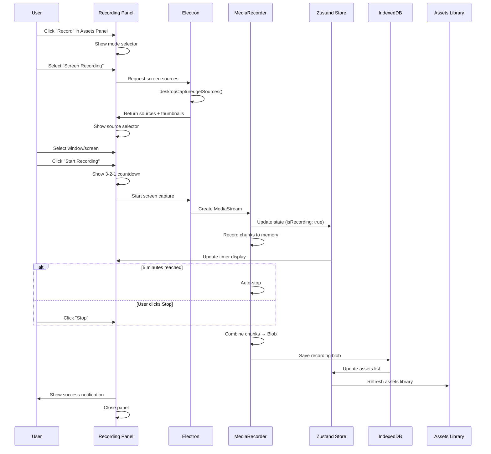

# ClipForge - Recording Features: Phase 1 PRD

## Foundation & Screen Recording

**Document Version**: 1.0  
**Phase**: 1 of 4  
**Duration**: Week 1 (5-7 days)  
**Last Updated**: 2025-10-29  
**Status**: Ready for Implementation

---

## Table of Contents

1. [Executive Summary](#executive-summary)
2. [Phase Goals](#phase-goals)
3. [Scope & Deliverables](#scope--deliverables)
4. [Technical Architecture](#technical-architecture)
5. [Implementation Tasks](#implementation-tasks)
6. [Component Specifications](#component-specifications)
7. [State Management](#state-management)
8. [Storage Layer](#storage-layer)
9. [Error Handling](#error-handling)
10. [Testing Requirements](#testing-requirements)
11. [Success Criteria](#success-criteria)
12. [Dependencies & Prerequisites](#dependencies--prerequisites)

---

## Executive Summary

### Phase Overview

Phase 1 establishes the foundation for all recording features in ClipForge. This phase focuses on building the core recording infrastructure, state management, and implementing screen recording as the first recording mode. By the end of this phase, users will be able to record their screen (full screen or window) with a professional recording panel UI, countdown timer, and automatic storage to the assets library.

### Why Phase 1 First?

- **Foundation First**: Core recording infrastructure reusable for webcam and PiP
- **Simplest Mode**: Screen recording is technically simpler than multi-stream PiP
- **High Value**: Screen recording is the most requested feature
- **Risk Mitigation**: Validates architecture before complex features

### Key Deliverables

1. Recording Panel UI with mode selection
2. Screen source selector with live thumbnails
3. Screen recording at 1080p @ 30fps
4. Recording controls (Start, Stop, Countdown, Timer)
5. IndexedDB storage integration
6. Basic error handling and permissions
7. Integration with existing Assets Library

---

## Phase Goals

### Primary Goals

1. ✅ **Enable screen recording**: Users can record full screen or specific windows
2. ✅ **Professional UX**: Smooth countdown, visual feedback, clear controls
3. ✅ **Reliable storage**: Recordings saved to IndexedDB without data loss
4. ✅ **Solid foundation**: State management and architecture for future phases

### Secondary Goals

1. ✅ **Performance**: Zero frame drops at 1080p/30fps on M1+ Macs
2. ✅ **Error handling**: Clear messages for permissions and storage issues
3. ✅ **Keyboard shortcuts**: Power users can record without mouse
4. ✅ **Assets integration**: Recordings appear in Assets Library automatically

### Non-Goals (Deferred to Later Phases)

- ❌ Audio recording (Phase 2)
- ❌ Webcam recording (Phase 2)
- ❌ Picture-in-Picture (Phase 3)
- ❌ Pause/Resume functionality (Phase 4)
- ❌ Advanced error recovery (Phase 4)

---

## Scope & Deliverables

### In Scope

#### 1. Recording Panel UI

- Slide-in panel from right side (400px width)
- Recording mode selector screen
- Screen source selector with thumbnails
- Recording controls (Start, Stop buttons)
- Real-time recording timer
- 3-2-1 countdown overlay
- Storage usage indicator

#### 2. Screen Recording

- Full screen capture
- Specific window capture
- Custom window selector UI
- Cursor capture (enabled by default)
- 1080p @ 30fps recording
- 5-minute maximum duration
- Auto-stop at time limit

#### 3. Storage & Data

- IndexedDB integration for video blobs
- Recording metadata storage
- Storage quota checking
- Two-phase storage (memory → DB)
- Assets Library integration

#### 4. Error Handling

- Screen recording permission flow
- Permission denied error messages
- Storage quota warnings
- Window closed during recording
- Generic error handling

### Out of Scope (This Phase)

- Audio capture (any kind)
- Webcam recording
- Multi-stream recording
- Pause/Resume functionality
- Advanced editing features
- Cloud sync for recordings
- Export functionality (already exists in ClipForge)

---

## Technical Architecture

### High-Level Flow



### Component Architecture

```
app/components/editor/
├── RecordingPanel/
│   ├── RecordingPanel.tsx          # Main container (NEW)
│   ├── ModeSelector.tsx            # Screen/Webcam/PiP selector (NEW)
│   ├── ScreenSelector.tsx          # Window picker UI (NEW)
│   ├── RecordingControls.tsx      # Start/Stop buttons (NEW)
│   ├── RecordingTimer.tsx         # Timer + progress bar (NEW)
│   ├── CountdownOverlay.tsx       # 3-2-1 countdown (NEW)
│   └── StorageIndicator.tsx       # Storage usage display (NEW)
│
├── AssetsPanel/
│   ├── SidebarButtons/
│   │   └── RecordButton.tsx       # Trigger recording panel (NEW)
│   └── tools-section/
│       └── RecordingsList.tsx     # Show recordings (NEW)

electron/
├── recording/                      # NEW
│   ├── screen-capture.ts          # desktopCapturer integration
│   └── permissions.ts             # Permission handlers
└── preload.ts                     # Add IPC channels (MODIFY)

app/store/slices/
└── recordingSlice.ts              # Recording state (NEW)

app/lib/
├── recording-validation.ts        # Pre-recording checks (NEW)
└── recording-storage.ts           # IndexedDB manager (NEW)

app/hooks/
├── useRecordingSession.ts         # Recording lifecycle (NEW)
└── useRecordingTimer.ts           # Timer logic (NEW)
```

### Technology Stack (Phase 1)

| Layer           | Technology          | Purpose                       |
| --------------- | ------------------- | ----------------------------- |
| **Desktop**     | Electron 27+        | desktopCapturer API           |
| **Recording**   | MediaRecorder API   | Browser-native recording      |
| **Storage**     | IndexedDB (idb)     | Video blob storage            |
| **State**       | Zustand             | Recording state management    |
| **UI**          | React 19 + Tailwind | Component framework           |
| **Video Codec** | VP9 or H.264        | Hardware-accelerated encoding |

---

## Implementation Tasks

[Full implementation tasks from the original document continue here - Tasks 1-14]

---

## Success Criteria

### Functional Requirements Met

- [x] User can open recording panel from Assets sidebar
- [x] User can select screen or window to record
- [x] User can start recording with 3-2-1 countdown
- [x] Recording captures at 1080p @ 30fps
- [x] Timer shows elapsed time and progress
- [x] Recording auto-stops at 5 minutes
- [x] User can manually stop recording
- [x] Recording saves to IndexedDB automatically
- [x] Recording appears in Assets Library
- [x] Keyboard shortcuts work (Cmd+Shift+R, Cmd+S)

### Performance Targets Met

- [ ] Recording starts in < 2 seconds from click
- [ ] Zero frame drops at 1080p/30fps
- [ ] CPU usage < 30% during recording
- [ ] Memory usage < 500 MB (excluding video buffer)
- [ ] UI remains responsive (60fps) during recording
- [ ] Storage indicator updates smoothly

### Quality Standards Met

- [ ] Clean, maintainable code
- [ ] Follows ClipForge architecture patterns
- [ ] TypeScript types complete and accurate
- [ ] Error handling comprehensive
- [ ] User feedback clear and helpful
- [ ] Visual design matches ClipForge style

### User Experience Goals

- [ ] Intuitive flow from start to finish
- [ ] Clear visual feedback at each step
- [ ] Professional countdown and timer UI
- [ ] Helpful error messages
- [ ] No confusing states or dead ends

---

## Dependencies & Prerequisites

### External Dependencies

- Electron 27+ with desktopCapturer API
- Browser MediaRecorder API support
- IndexedDB (idb library already installed)
- UUID library for ID generation

### Internal Dependencies

- Zustand store infrastructure (already exists)
- Assets Panel structure (already exists)
- Tailwind CSS styling (already configured)
- Toast notification system (react-hot-toast)

### System Requirements

- macOS 11+ (Big Sur or later)
- Screen recording permission granted
- Minimum 2 GB available storage

---

## Timeline & Milestones

### Day 1-2: Foundation

- [ ] Setup project structure
- [ ] Create recording state management
- [ ] Implement Electron screen capture
- [ ] Build Recording Panel container

**Milestone**: Panel opens, sources load

### Day 3-4: Recording Flow

- [ ] Build mode selector UI
- [ ] Build screen selector UI
- [ ] Implement countdown overlay
- [ ] Create timer and controls

**Milestone**: Can select source and see countdown

### Day 5-6: Recording Implementation

- [ ] Implement MediaRecorder session
- [ ] Integrate IndexedDB storage
- [ ] Add thumbnail generation
- [ ] Build storage indicator

**Milestone**: Can record and save to storage

### Day 7: Polish & Testing

- [ ] Add keyboard shortcuts
- [ ] Implement error handling
- [ ] Assets library integration
- [ ] Testing and bug fixes

**Milestone**: Phase 1 complete and stable

---

## Handoff to Phase 2

### What's Ready for Phase 2

- ✅ Recording Panel UI framework
- ✅ Recording state management infrastructure
- ✅ MediaRecorder session handling
- ✅ IndexedDB storage layer
- ✅ Assets Library integration pattern
- ✅ Error handling framework
- ✅ Permission flow patterns

### Phase 2 Prerequisites

- Phase 1 fully tested and stable
- Performance benchmarks met
- User feedback incorporated
- Code review completed

---

**End of Phase 1 PRD**
