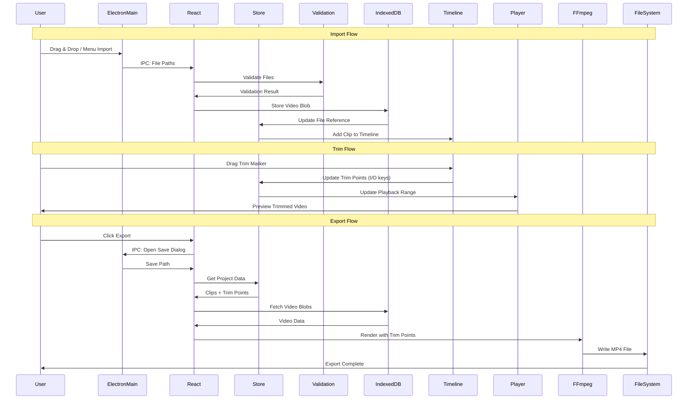
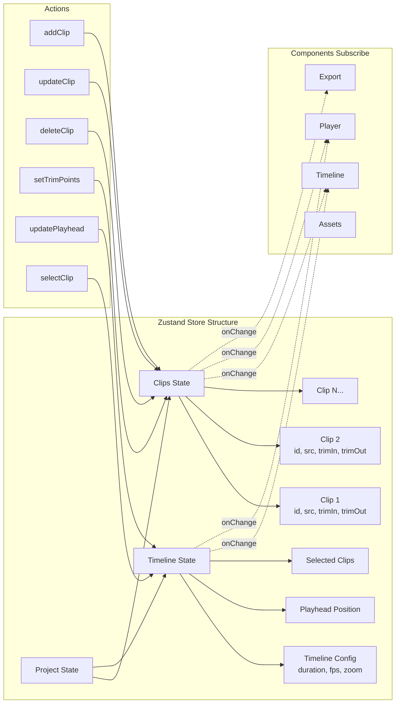
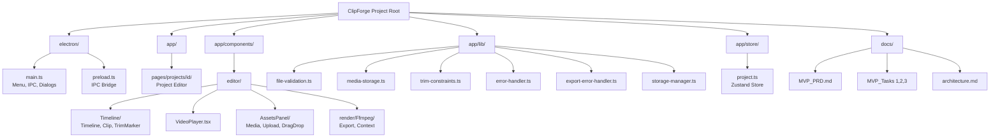
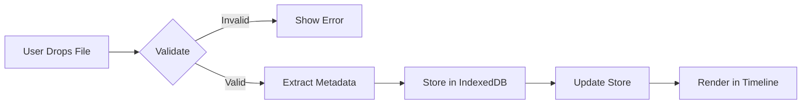
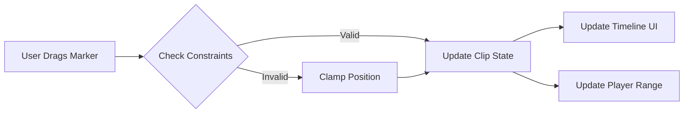
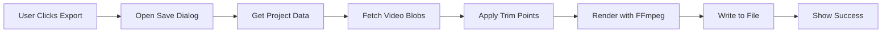
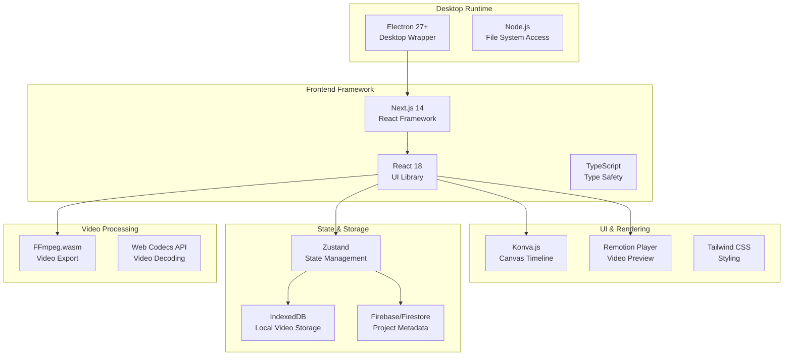
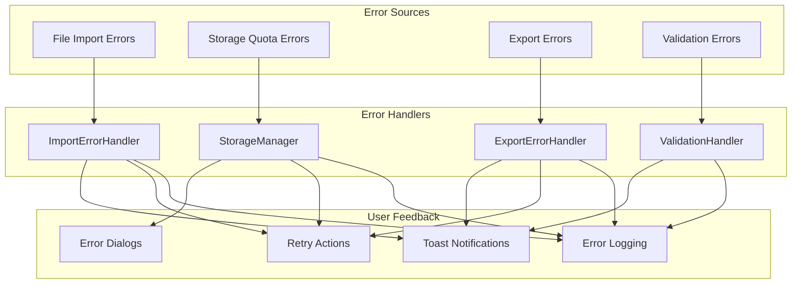
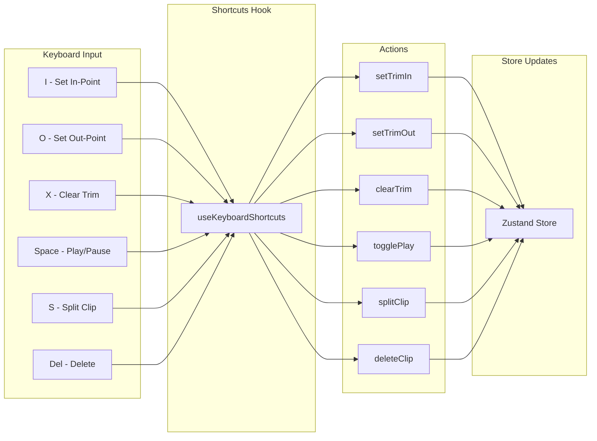

# Architecture

# ClipForge MVP - Architecture Diagram

**Document Version**: 1.0  
**Last Updated**: 2025-10-28

---

## System Architecture Overview

```mermaid
graph TB
    subgraph "Desktop Layer - Electron"
        EM[Main Process<br/>electron/main.ts]
        EP[Preload Script<br/>electron/preload.ts]
        EM -->|IPC Bridge| EP

        subgraph "Native OS APIs"
            Menu[Menu Bar]
            Dialog[File Dialogs]
            FS[File System]
        end

        EM --> Menu
        EM --> Dialog
        EM --> FS
    end

    subgraph "Application Layer - Next.js"
        subgraph "Pages"
            ProjectPage[Project Editor<br/>pages/projects/id]
            HomePage[Home/Projects List]
        end

        subgraph "Core Components"
            Timeline[Timeline Container<br/>Konva.js Canvas]
            Player[Video Player<br/>Remotion Player]
            Assets[Assets Panel<br/>Media Library]
            Export[Export Module<br/>FFmpeg Integration]
        end

        subgraph "UI Components"
            TrimMarker[Trim Markers]
            DragDrop[Drag & Drop Zone]
            Controls[Playback Controls]
            MenuUI[Menu Event Handlers]
        end

        ProjectPage --> Timeline
        ProjectPage --> Player
        ProjectPage --> Assets
        ProjectPage --> Export

        Timeline --> TrimMarker
        Assets --> DragDrop
        Timeline --> Controls
        ProjectPage --> MenuUI
    end

    subgraph "State Management Layer"
        Store[Zustand Store<br/>store/project.ts]
        ClipState[Clip State<br/>trimIn, trimOut, position]
        ProjectState[Project State<br/>clips, timeline, settings]

        Store --> ClipState
        Store --> ProjectState
    end

    subgraph "Business Logic Layer"
        subgraph "Media Processing"
            Validation[File Validation<br/>lib/file-validation.ts]
            MediaStorage[Media Storage<br/>lib/media-storage.ts]
            VideoMeta[Video Metadata<br/>Extraction]
        end

        subgraph "Trim Logic"
            TrimConstraints[Trim Constraints<br/>lib/trim-constraints.ts]
            TrimCalculations[Trim Calculations]
        end

        subgraph "Error Handling"
            ImportErrors[Import Error Handler<br/>lib/error-handler.ts]
            ExportErrors[Export Error Handler<br/>lib/export-error-handler.ts]
            StorageManager[Storage Manager<br/>lib/storage-manager.ts]
        end

        subgraph "Keyboard System"
            Shortcuts[Keyboard Shortcuts<br/>hooks/useKeyboardShortcuts.ts]
        end
    end

    subgraph "Storage Layer"
        subgraph "Local Storage"
            IDB[(IndexedDB<br/>Video Files)]
            LocalDB[(LocalStorage<br/>Preferences)]
        end

        subgraph "Cloud Storage"
            Firestore[(Firestore<br/>Project Metadata)]
        end
    end

    subgraph "External Services"
        FFmpeg[FFmpeg.wasm<br/>Video Export Engine]
        Browser[Browser APIs<br/>Video Element, Canvas]
    end

    %% Data Flow - User Actions
    EP -->|IPC Events| ProjectPage
    MenuUI -->|Menu Actions| EM
    DragDrop -->|Files| Validation

    %% Data Flow - Import
    Validation -->|Valid Files| MediaStorage
    MediaStorage -->|Store Blob| IDB
    MediaStorage -->|Extract Metadata| VideoMeta
    VideoMeta -->|Update State| Store

    %% Data Flow - State Management
    Timeline -->|User Actions| Store
    Player -->|Playback State| Store
    TrimMarker -->|Trim Changes| TrimConstraints
    TrimConstraints -->|Validated Trim| Store
    Store -->|State Updates| Timeline
    Store -->|State Updates| Player

    %% Data Flow - Export
    Export -->|Get Project Data| Store
    Store -->|Clips & Settings| Export
    Export -->|Render Commands| FFmpeg
    IDB -->|Video Data| Export
    FFmpeg -->|Encoded Video| FS

    %% Data Flow - Persistence
    Store -->|Save Project| Firestore
    Firestore -->|Load Project| Store

    %% Data Flow - Playback
    IDB -->|Video Blobs| Player
    Player -->|Render| Browser
    Store -->|Trim Points| Player

    %% Error Handling Flow
    MediaStorage -.->|Errors| ImportErrors
    Export -.->|Errors| ExportErrors
    IDB -.->|Quota Errors| StorageManager
    ImportErrors -.->|User Notification| ProjectPage
    ExportErrors -.->|User Notification| ProjectPage

    %% Keyboard Shortcuts
    Shortcuts -->|Trim Actions| TrimMarker
    Shortcuts -->|Playback Actions| Controls
    Shortcuts -->|Timeline Actions| Timeline

    style EM fill:#e1f5ff
    style Store fill:#fff4e1
    style IDB fill:#f0f0f0
    style Firestore fill:#f0f0f0
    style FFmpeg fill:#ffe1f5
    style Timeline fill:#e8f5e1
    style Player fill:#e8f5e1
```

---

## Component Interaction Diagram

---

## State Management Architecture

---

## File Organization

---

## Data Flow Patterns

### Import Pattern

### Trim Pattern

### Export Pattern

---

## Technology Stack

---

## Error Handling Flow

---

## Keyboard Shortcuts System

---

## Notes

### Architecture Principles

1. **Separation of Concerns**: Clear boundaries between Electron, React, business logic, and storage
2. **Unidirectional Data Flow**: User actions → Store → UI updates
3. **Error Boundaries**: Comprehensive error handling at each layer
4. **State Management**: Centralized Zustand store for all application state
5. **Performance**: Async operations, optimistic updates, efficient rendering

### Key Design Decisions

- **Electron for Desktop**: Native OS integration, file system access, menu bar
- **IndexedDB for Media**: Large video files stored locally, not in memory
- **Firestore for Projects**: Cloud sync for project metadata only
- **FFmpeg.wasm for Export**: Client-side video encoding, no server needed
- **Konva.js for Timeline**: High-performance canvas rendering
- **Remotion for Preview**: React-based video composition

### Data Flow Principles

- User interactions captured by React components
- Validation happens before state updates
- Store notifies components of state changes
- Components re-render based on store updates
- Async operations (import, export) show progress
- Errors caught and displayed with recovery options

---

**Related Documents**:

- [MVP_PRD.md](MVP_PRD.md) - Product Requirements
- [MVP_Tasks1.md](MVP_Tasks1.md) - Implementation Tasks Part 1
- [MVP_Tasks2.md](MVP_Tasks2.md) - Implementation Tasks Part 2
- [MVP_Tasks3.md](MVP_Tasks3.md) - Implementation Tasks Part 3
